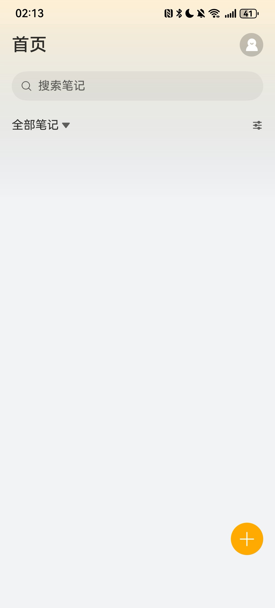
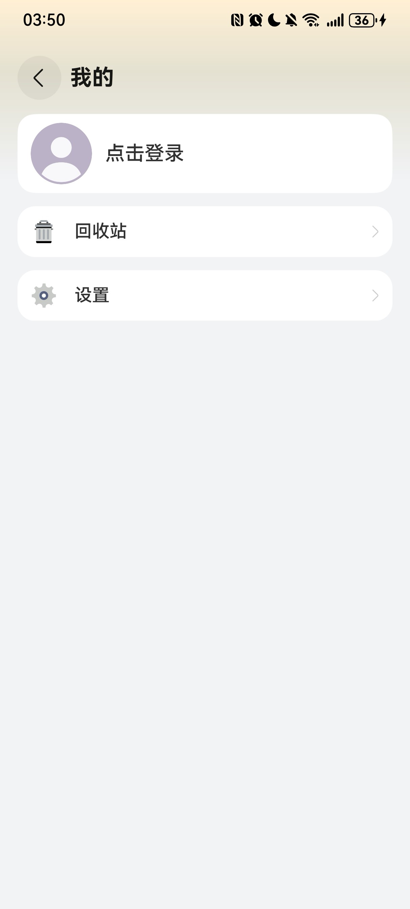

# 商务（笔记）应用模板快速入门

## 目录
- [功能介绍](#功能介绍)
- [环境要求](#环境要求)
- [快速入门](#快速入门)
- [示例效果](#示例效果)
- [权限要求](#权限要求)
- [开源许可协议](#开源许可协议)


## 功能介绍
您可以基于此[模板](#模板)直接定制应用，也可以挑选此模板中提供的多种[组件](#组件)使用，从而降低您的开发难度，提高您的开发效率。

### 模板

本模板为笔记类应用提供了常用功能的开发样例，模板主要分首页、我的两大模块：

1、首页：展示全部笔记，分类，搜索，排序，编辑笔记

2、我的：提供回收站以及保密设置


本模板已集成账号服务，只需做少量配置和定制即可快速实现华为账号一键登录。


| 首页                                    | 我的                                |
|---------------------------------------|-----------------------------------|
|  |  |

本模板主要页面及核心功能如下所示：

```ts
笔记模板
 |-- 首页
 |    |-- 搜索
 |    |-- 笔记分类
 |    |    |-- 新建分类
 |    |    |-- 重命名 
 |    |    └-- 删除分类
 |    |-- 排序
 |    |    |-- 按创建时间排序
 |    |    └-- 按修改时间排序     
 |    |-- 笔记列表
 |    |    |-- 复制内容
 |    |    |-- 移动到其他分类
 |    |    └-- 删除
 |    |-- 创建笔记
 |    |    |-- 保存
 |    |    └-- 分享笔记
 |    └-- 编辑笔记
 |         |-- 保存
 |         └-- 分享笔记
 └-- 我的
      |-- 用户信息
      |    |-- 华为账号一键登录
      |    └-- 头像昵称修改
      └-- 回收站
      |    |-- 搜索笔记
      |    |-- 恢复笔记
      |    └-- 彻底删除
      └-- 设置
           |-- 隐私协议
           |-- 保密设置
           |    |-- 手势密码
           |    └-- 指纹解锁
           └-- 退出登录
```


本模板工程代码结构如下所示：

```ts
Notes
  |- common                                        // 公共层
  |   |- datasource/src/main/ets/                  // 公共资源
  |   |    |- CategoryService.ets                  // 分类服务
  |   |    |- Data.ets                             // mock数据
  |   |    |- Model.ets                            // 建立模型
  |   |    └- NoteService.ets                      // 笔记服务
  |   └- utils/src/main/ets                        // 公共组件模块(hsp)
  |        |- constants 
  |        |     CommonConstants.ets               // 公共常量        
  |        |     DateConstants.ets                 // 日期格式化常量                   
  |        └- utils                                // 工具类
  |              AccountUtil.ets                   // 账号
  |              AppUtil.ets                       // 应用  
  |              DateUtil.ets                      // 日期处理
  |              LogUtil.ets                       // 日志工具   
  |              ObjectUtil.ets                    // 对象工具   
  |              ShowToast.ets                     // 吐司   
  |              StringUtil.ets                    // 字符串工具
  |
  |- components                                    // 公共组件
  |   |- richeditor/src/main/ets/                  // 富文本组件
  |   |    |- common 
  |   |    |     Constants.ets                     // 公共常量         
  |   |    |- components                           
  |   |    |     RichEditorArea.ets                // 富文本编辑
  |   |    |     SnapshotPreview.ets               // 截图预览
  |   |    |- model 
  |   |    |     AlignmentInfo.ets                 // 编辑富文本框段落选项       
  |   |    └- util
  |   |          CommonUtils.ets                   // 常用(沉睡/截图)     
  |   |          ControllerUtil.ets                // 本项目使用      
  |   |          ImageUtils.ets                    // 图片处理
  |   |          PickerUtil.ets                    // 选择、保存图片    
  |   |          PopupUtils.ets                    // 截图计算
  |   |          RichEditorUtil.ets                // 富文本编辑器工具类
  |   |    
  |   └- secretlock/src/main/ets/                  // 应用密码设置组件
  |        |- components                           
  |        |     SecretLockSwitch.ets              // 密码设置开关
  |        |- model 
  |        |     AuthOptions.ets                   // 认证参数类
  |        |     SecretLock.ets                    // 密码锁-保密设置(持久化)
  |        |- pages                           
  |        |     DrawLock.ets                      // 密码设置绘制页面
  |        └- util                           
  |              AuthUtil.ets                      // 生物识别认证工具类    
  |
  └- product/phone                               
      └---src/main/ets 
           |- common
           |   LoginConstants.ets                  // 登录常量
           |- components
           |   RightArrow.ets                      // 右箭头                  
           |- entryability
           |   EntryAbility.ets                    // 主页面                                                                                                                       
           └- pages
               mine                                // 我的-相关页面
                |- MineView.ets                    // 我的页面入口
                |- PrivacyAgreement.ets            // 隐私协议(隐私政策)
                |- QuickLoginPage.ets              // 一键登录
                |- SecretSetting.ets               // 保密设置
                |- Setting.ets                     // 设置
                |- Trash.ets                       // 回收站
                └- UserInfoPage.ets                // 用户信息
               EditorCategory.ets                  // 编辑分类
               EditNotes.ets                       // 编辑笔记
               Index.ets                           // 入口页面
```

### 组件
本模板中提供了两种组件，您可以按需选择合适的组件进行使用，所有组件存放在工程根目录的components下。

| 组件                          | 描述    | 使用指导                                             |
|-----------------------------|-------|--------------------------------------------------|
| 应用密码设置组件（secretlock）        | 应用密码设置 | [使用指导](components/secretlock/README.md)      |
| 富文本编辑组件（richeditor）         | 富文本编辑 | [使用指导](components/richeditor/README.md)    |


## 环境要求
### 软件
* DevEco Studio版本：DevEco Studio 5.0.4 Release及以上
* HarmonyOS SDK版本：HarmonyOS 5.0.2(14) Release SDK及以上
### 硬件
* 设备类型：华为手机（直板机）
* HarmonyOS版本：HarmonyOS 5.0.1 Release及以上

## 快速入门
### 配置工程
在运行此模板前，需要完成以下配置：

1. 在DevEco Studio中打开此模板。

2. 在AppGallery Connect创建应用，将包名配置到模板中。

   a. 参考[创建HarmonyOS应用](https://developer.huawei.com/consumer/cn/doc/app/agc-help-createharmonyapp-0000001945392297)为应用创建APPID，并进行关联。

   b. 返回应用列表页面，查看应用的包名。

   c. 将模板工程根目录下AppScope/app.json5文件中的bundleName替换为创建应用的包名。

3. 配置华为账号服务。

   a. 将应用的client ID配置到entry模块的module.json5文件，详细参考：配置[Client ID](https://developer.huawei.com/consumer/cn/doc/harmonyos-guides/account-client-id)。

   b. 添加公钥指纹，详细参考：[配置应用证书指纹](https://developer.huawei.com/consumer/cn/doc/app/agc-help-signature-info-0000001628566748#section5181019153511)。


### 运行调试工程
1. 连接调试手机和PC。

2. 对应用签名：由于模板中集成了华为账号一键登录，所以需要采用[手工签名](https://developer.huawei.com/consumer/cn/doc/harmonyos-guides/ide-signing)。

3. 菜单选择“Run > Run 'phone' ”或者“Run > Debug 'phone' ”，运行或调试模板工程。

## 示例效果
### 视频播放列表
[功能展示录屏](./screenshots/功能展示录屏.mp4)

## 权限要求
身份认证权限: ohos.permission.ACCESS_BIOMETRIC
网络权限: ohos.permission.INTERNET
获取网络信息: ohos.permission.GET_NETWORK_INFO

## 开源许可协议
该代码经过[Apache 2.0 授权许可](https://www.apache.org/licenses/LICENSE-2.0)。