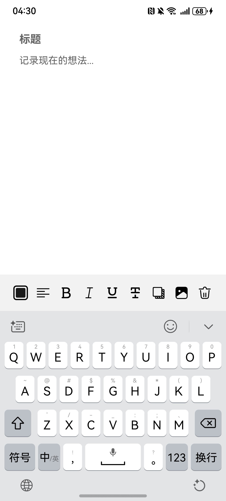

# 富文本编辑组件快速入门

## 目录

- [简介](#简介)
- [使用](#使用)
- [API参考](#API参考)
- [示例代码](#示例代码)

## 简介

本组件提供了富文本编辑功能



## 使用
1. 安装组件。
   将模板根目录的components下[richeditor](../../components/richeditor)目录拷贝至您工程根目录components/。
```typescript
// entry/oh-package.json5
"dependencies": {
   "richeditor": "../components/richeditor"
} 
```
```typescript
// build-profile.json5
"modules": [
   {
      "name": "richeditor",
      "srcPath": "./components/richeditor",
   }
]
```

2. 引入组件。

```typescript
import { RichEditorArea } from 'richeditor';
```

3. 调用组件，详细参数配置说明参见[API参考](#API参考)。

```typescript
RichEditorArea({
  richEditorController: this.richEditorController,
  bussController: this.bussController,
  noteContent: this.currentNote.content,
  onEditorChange: (hasChange) => {
     this.hasEdit = hasChange;
  },
  noteTitle: this.currentNote.title,
  titleChange: (title: string) => {
     this.noteTitle = title;
  },
});
```

## API参考

### 接口
RichEditorArea(options: RichEditorAreaOptions)

富文本编辑组件。


### UploadRecipeData对象说明

| 名称          | 类型                                         | 必填 | 说明       |
|-------------|--------------------------------------------|----|----------|
| richEditorController       | RichEditorController                       | 是  | 富文本控制器   |
| bussController     | [BussController](#BussController对象说明)      | 是  | 自定义业务控制器 |
| noteContent | string                                     | 是  | 笔记内容     |
| noteTitle       | string                                     | 是  | 笔记标题     |

### BussController对象说明

| 名称       | 类型              | 必填 | 说明   |
|----------|-----------------|----|------|
| shareData     | CallBack<avoid> | 是  | 分享逻辑 |

### 事件

支持以下事件：

#### onEditorChange
onEditorChange(callback: (hasChange: boolean) => void),
// 监听是否编辑

#### titleChange
titleChange(callback: (title: string) => void),
// 监听标题是否变化

## 示例代码

```typescript
import { BussController, RichEditorArea } from 'richeditor';
import { common } from '@kit.AbilityKit';
import { KeyboardAvoidMode } from '@kit.ArkUI';

@Entry
@ComponentV2
struct Index {
   @Provider('appPathStack') appPathStack: NavPathStack = new NavPathStack();
   context: common.UIAbilityContext = getContext(this) as common.UIAbilityContext;
   @Local noteTitle: string = '';
   @Local hasEdit: boolean = false;
   private richEditorController: RichEditorController = new RichEditorController();
   private bussController: BussController = new BussController();

   aboutToAppear(): void {
      // 启用压缩模式避让软键盘
      this.context.windowStage.getMainWindowSync()
      .getUIContext()
      .setKeyboardAvoidMode(KeyboardAvoidMode.RESIZE_WITH_CARET);
   }

   aboutToDisappear(): void {
      // 还原默认上抬模式
      this.context.windowStage.getMainWindowSync()
      .getUIContext()
      .setKeyboardAvoidMode(KeyboardAvoidMode.OFFSET);
   }

   build() {
      Column() {
         RichEditorArea({
            richEditorController: this.richEditorController,
            bussController: this.bussController,
            noteContent: '',
            onEditorChange: (hasChange: boolean) => {
               this.hasEdit = hasChange;
            },
            noteTitle: '',
            titleChange: (title: string) => {
               this.noteTitle = title;
            },
         })
            .layoutWeight(1);
      }
      .height('100%')
      .width('100%');
   };
}

```


