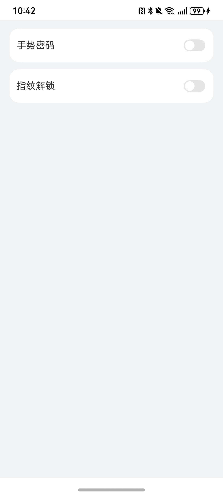
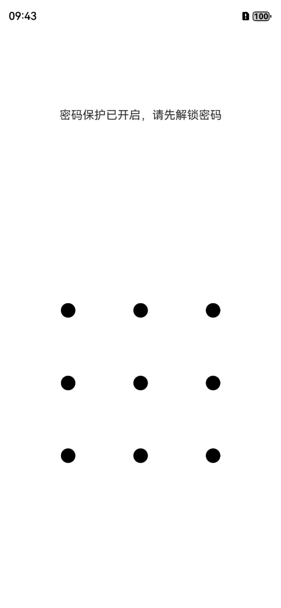
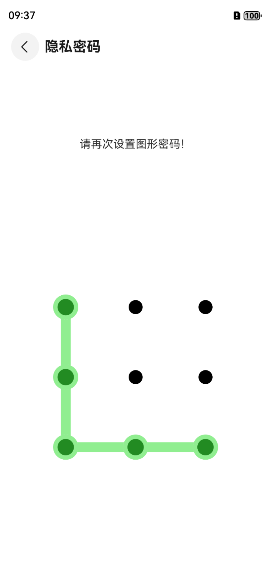

# 应用密码设置组件快速入门

## 目录

- [简介](#简介)
- [使用](#使用)
- [API参考](#API参考)
- [示例代码](#示例代码)

## 简介

本组件提供了密码设置功能，密码已进行持久化存储



## 使用

1. 安装组件。
   将模板根目录的components下[secretlock](../../components/upload_recipe)目录拷贝至您工程根目录components/。
```typescript
// entry/oh-package.json5
"dependencies": {
   "secretlock": "../components/secretlock"
} 
```
```typescript
// build-profile.json5
"modules": [
   {
      "name": "secretlock",
      "srcPath": "./components/secretlock",
   }
]
```

2. 引入组件。

```typescript
import { SecretLock, SecretLockSwitch } from 'secretlock';
```

3. 调用组件，详细参数配置说明参见[API参考](#API参考)。

```typescript
SecretLockSwitch({
  appPathStack: this.appPathStack
});
```
4. 可以在应用入口处调用，关闭进程重新进入应用后会跳转到密码绘制页面

```typescript
@Local secretLock: SecretLock = PersistenceV2.connect(SecretLock, () => new SecretLock())!!;

aboutToAppear(): void {
 if (this.secretLock.gesture) {
   const params: Record<string, boolean | NavPathStack> = { 'fromEntrance': true, 'appPathStack': this.appPathStack };
   this.appPathStack.pushPathByName('DrawLock', params);
 }
}
``` 


## API参考
### 接口
SecretLockSwitch(appPathStack: NavPathStack)

应用密码设置组件。


### 参数

| 名称          | 类型                                        | 必填 | 说明    |
|-------------|-------------------------------------------|----|-------|
| appPathStack       | NavPathStack                              | 是  | 路由  |

## 示例代码
**权限配置**
已在 module.json5 中添加如下权限
```typescript
 "requestPermissions": [
   {
     "name": "ohos.permission.ACCESS_BIOMETRIC" //允许应用使用生物特征识别能力进行身份认证。
   }
 ]
```     
```typescript
import { SecretLock, SecretLockSwitch } from 'secretlock';
import { PersistenceV2 } from '@kit.ArkUI';

@Entry
@ComponentV2
export struct Index {
   @Provider('appPathStack') appPathStack: NavPathStack = new NavPathStack();

   @Local secretLock: SecretLock = PersistenceV2.connect(SecretLock, () => new SecretLock())!!;

   aboutToAppear(): void {
      if (this.secretLock.gesture) {
      const params: Record<string, Object> = { 'fromEntrance': true, 'appPathStack': this.appPathStack };
      this.appPathStack.pushPathByName('DrawLock', params);
    }
   }

   build() {
      Navigation(this.appPathStack){
         SecretLockSwitch({
            appPathStack: this.appPathStack
         });
      }
      .hideTitleBar(true)
      .mode(NavigationMode.Stack)
   }
}
```
